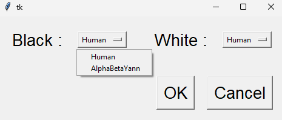

# Ia41_project
Ce git présente le projet réalisé dans le cadre du cours d'IA41 de l'UTBM par trois étudiants de l'UTBM :
- Numidia NIMHAOULIN
- Guillaume STRABACH
- Yann COMOR

Il s'agit d'une implémentation du jeu Teeko en python avec une interface graphique et des IA.

**But du jeu :**  
Placer ses pions puis les déplacer pour former un alignement (horizontal, vertical ou en diagonal) ou
un carré de 4 pions.

**Description du jeu :**  
Le plateau est vide en début de partie. Tour à tour, les joueurs posent un de leurs pions sur une
intersection libre (emplacements de 1 à 25 sur la figure ci-dessus). Une intersection est libre si elle
ne contient pas déjà un pion. A la fin de cette phase de pose, si aucun joueur n'a obtenu de
configuration gagnante (alignement ou carré de 4 pions), les joueurs déplacent à tour de rôle l'un de
leurs pions. Un pion déplacé ne peut l'être que sur un emplacement libre adjacent. Dès qu'un joueur
réalise une configuration gagnante, la partie s'arrête.

## Organisation du projet

    IA41_PROJECT     
    ├── 01_Documents/      
    │   ├── IA41 Projets2024.pdf   <- File with the project requirements    
    │   ├── IA41 Sujet Teeko.pdf   <- File with the game logic   
    │   ├── Proj_teeko.txt         <- File used to iterate on the project and to dispatch tasks      
    │   └── Teeko.docx             <- File used to iterate on the project and to dispatch tasks       
    ├── 02_Code/   
    │   ├── ai/                 <- Folder with the AI code
    │   └── __pycache__/
    │   ├── teeko_gui.py        <- File with the GUI code
    │   ├── teeko_models.py     <- File with the game logic
    │   └── teeko.py            <- File with the game logic
    ├── images/                 <- Folder with the images used in the README
    ├── requirements.txt        <- File with the python librairies used to run the code
    ├── .gitignore
    └── README.md


# Code executable

## Téléchargement du code

Pour télécharger le code, il suffit de cloner le repository : 
**via HTTPS**
```bash
git clone https://github.com/YannCmr/Ia41_project.git
```

**via SSH**
```bash
git clone git@github.com:YannCmr/Ia41_project.git
```

puis il faut se rendre dans le dossier du projet : 
```bash
cd Ia41_project
```

## Création de l'environnement requis

Commencer par créer un venv python : 
```bash
python -m venv venv
```

Puis l'activer :
sur Windows  
```bash
venv\Scripts\activate
```
sur Linux
```bash
source venv/bin/activate
```

Installer les packages python requis : 
```bash
pip install -r requirements.txt
```

## Lancer le jeu
Ce rendre dans le dossier "02_Code" :
```bash
cd 02_Code
```

Puis lancer le jeu :
```bash
python teeko_gui.py
```

## Lancer le jeu avec l'IA
Commencer par déposer l'IA dans le dossier "02_Code/ai" :

Puis lancer le jeu :
```bash
python teeko_gui.py
```

Aller dans "Game" -> "Game Settings" et choisir l'IA/le joueur dans le menu déroulant.  
Puis cliquer sur "OK" pour lancer la partie.


